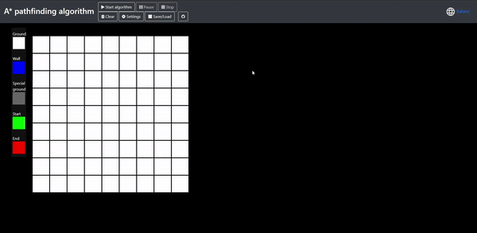

# A* pathfinding algorithm simulator
Astar algorithm applied to a pathfinding scenario, with the ability to see the algorithm in action, step by step.
 
## :red_circle: Online version
A live version is available [here](https://tendto.github.io/AstarPathfindingAlgorithm/)

 
## :books: Documentation
[Code documentation](doc/doc_code.md) 
[Settings documentation](doc/doc_settings.md)

## 🤝 Contributing

Contributions, issues and feature requests are welcome. 
I'd especially appreciate every feedback aimed at improving the presentation and any bug report

## :wrench: Made with
[p5.js library](https://github.com/processing/p5.js) 
[BOOSTRAP](https://getbootstrap.com/)

## :book: Reference sources

[Wikipedia](https://en.wikipedia.org/wiki/A*_search_algorithm) 
[Heuristics](http://theory.stanford.edu/~amitp/GameProgramming/Heuristics.html)

## :thought_balloon: Inspired by
[Logic Circuit Simulator](https://github.com/drendog/Logic-Circuit-Simulator)

## 👤 Author

**[Tend](https://github.com/TendTo)**

## :balance_scale: License

[MIT](https://choosealicense.com/licenses/mit/)
